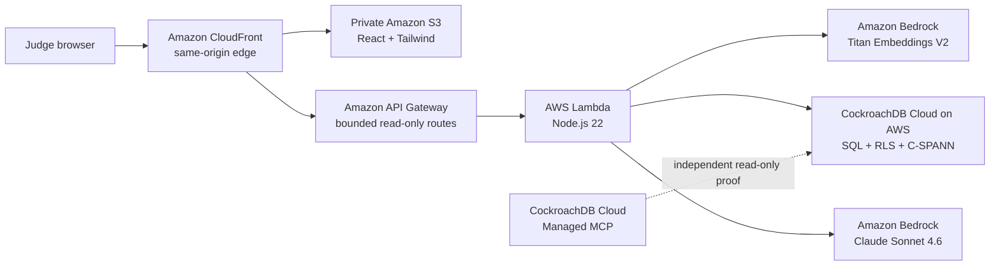

# Archon Memory Control Room

**A Financial Memory Control Room that lets a CFO ask what the books forgot,
inspect the exact evidence behind the answer, and see when persistent memory
disagrees with itself.**

This is the CockroachDB AI Challenge entry at
[upgradedev/archon-cockroach-memory](https://github.com/upgradedev/archon-cockroach-memory).
It uses CockroachDB as durable, distributed agent memory and AWS Bedrock for
embeddings and grounded narration.

## Working challenge slice

The working challenge slice is intentionally precise:

- One fixed synthetic company: **Helios SA**.
- A public, read-only investigation surface; callers cannot select a tenant,
  company, database, model, or write tool.
- Persistent memories stored beside provenance and lifecycle state.
- Native C-SPANN semantic recall, filtered by tenant, embedding model, active
  lifecycle state, and company.
- A cited Bedrock answer with relevance abstention, per-claim citation checks,
  numeric checks, and deterministic evidence fallback.
- A complete-scope, read-only audit for contradictions and missing counterparts.
- A live proof ledger for database version, runtime principal, active record
  count, vector index, models, and fixed scope.

The broader Archon document-extraction and financial-reconciliation platform is
product vision and reusable domain context; it is not presented as functionality
of this judge-facing application.

## Why this is agentic memory

An ordinary RAG demo retrieves chunks from a static corpus. Archon Memory keeps
durable facts learned across independent sessions and makes their state explicit:

1. A learned fact has an idempotency key, content hash, provenance, embedding
   model, status, timestamps, and optional supersession link.
2. A later question recalls only compatible, active evidence through CockroachDB's
   native distributed vector index.
3. The answer cites exact stored memories; unsupported or weakly related evidence
   causes abstention or deterministic fallback.
4. A separate exhaustive audit compares the memory across sessions and surfaces
   contradictions and dangling references without mutating the data.

The differentiator is simple: **the memory can disagree out loud before an agent
acts on it.**

## Architecture



The application workload is fixed to `eu-west-1`. CloudFront is a global AWS edge
service; it does not reintroduce an application workload in `us-west-2`.

## Required CockroachDB tools: 2 of 4

The entry uses the two required tools below. It does not count ccloud or the
self-hosted MCP surface toward this total.

### 1. Distributed Vector Indexing

`agent_memory.embedding VECTOR(1024)` is indexed by CockroachDB-native
`CREATE VECTOR INDEX ... vector_cosine_ops`. This is C-SPANN, not the pgvector
extension.

Production recall equality-constrains:

- `tenant_id`
- `embed_model`
- `status = 'active'`
- `company = 'Helios SA'`

The schema contains both benchmark-oriented global indexing and prefix vector
indexes for the production scope. `EXPLAIN` evidence, recall@k measurements,
multi-range fan-out, RF=3 distribution, and node-loss survival are recorded in
[docs/BENCHMARK.md](./docs/BENCHMARK.md) and
[docs/CLOUD_SMOKE.md](./docs/CLOUD_SMOKE.md).

### 2. CockroachDB Cloud Managed MCP

The hosted Managed MCP endpoint has been exercised against the live CockroachDB
Cloud cluster with bounded, read-only calls for cluster identity, table listing,
schema inspection, and a fixed-scope query. Credentials and connection material
are never emitted.

Evidence and the reproducible operator path:

- [docs/MANAGED_MCP_SMOKE.md](./docs/MANAGED_MCP_SMOKE.md)
- [scripts/cloud-mcp-audit.ts](./scripts/cloud-mcp-audit.ts)
- [.github/workflows/managed-mcp-audit.yml](./.github/workflows/managed-mcp-audit.yml)

### Additional, not counted

- `src/mcp/server.ts` exposes application-level `remember_memory`,
  `recall_memory`, and `audit_memory` tools for MCP-speaking agents.
- `scripts/provision-cluster.sh` contains current ccloud Basic-cluster operator
  automation. ccloud is not counted until an authenticated ccloud receipt exists.

The canonical tool inventory is [docs/TOOLS.md](./docs/TOOLS.md).

## AWS implementation

The deployment follows the AWS serverless web application reference pattern:

- Private, encrypted, versioned S3 origin.
- CloudFront Origin Access Control, same-origin `/api/*`, HTTP/2+3, compression,
  CSP/HSTS/security headers, and SPA routing.
- API Gateway HTTP API with route-level throttling and no public mutation route.
- Lambda Node.js 22 with reserved concurrency, X-Ray, retained logs, and bounded
  request/retrieval work.
- Secrets Manager stores the least-privilege CockroachDB connection under a
  deterministic environment name; the URI is never a Lambda environment
  variable, GitHub secret, or CloudFormation parameter.
- Titan Text Embeddings V2 creates normalized 1024-dimensional vectors.
- Claude Sonnet 4.6 narrates from untrusted evidence through Bedrock Converse.
- CloudWatch alarms and an operations dashboard cover Lambda, API, and delivery.

The infrastructure is defined in [aws/template.yaml](./aws/template.yaml).
Real eu-west-1 Bedrock proof is captured in
[docs/BEDROCK_SMOKE.md](./docs/BEDROCK_SMOKE.md).

## CI/CD

The release path is source-controlled:

```text
secret scan
  → dependency gates
  → TypeScript/unit/integration/security/load/node-loss tests
  → React unit + desktop/mobile Playwright
  → SAM lint/build
  → source-readiness gate
  → build once
  → cryptographic candidate receipt
  → protected database release (ordered fail-closed RLS + idempotent seed + runtime denial probes)
  → OIDC staging deploy + real smoke + hosted Playwright
  → identical-candidate production promotion
  → continuously exercised canary + real smoke + hosted Playwright
  → recover previous traffic alias and versioned S3 index on verification failure
```

Supply-chain references are immutable commit/image digests. Staging, production,
and database-operator OIDC subjects are bound to their GitHub environments.
Bootstrap owns the environment-specific Lambda and CodeDeploy roles; the SAM
application stack is CI-gated to synthesize no IAM resources. The one-time roles
and artifact bucket are defined in
[aws/bootstrap-oidc.yaml](./aws/bootstrap-oidc.yaml).

This repository does **not** call the pipeline “live-complete” merely because
the YAML exists. Full CI/CD is established only after main CI, staging,
protected database release, staging, production, hosted E2E, Managed MCP audit,
and deployment receipts have all completed successfully.

## Security and trust boundaries

- CockroachDB RLS is bound to the `archon_public_reader` role and the exact
  `public-demo / Helios SA / active` scope. It does not trust mutable
  `application_name` as an identity.
- Initial provisioning creates a dedicated login that inherits the NOLOGIN
  reader role. Existing secrets fail closed; credential rotation is not claimed
  until an explicit two-principal pending/activate/retire workflow is implemented.
- The public API accepts recall questions only in JSON `POST` bodies; questions
  never enter URLs or access logs.
- Request bytes, question length, top-k, audit scan, API rate, concurrency, and
  model calls are bounded.
- Database/AWS exceptions are redacted; Lambda failures still reach native error
  metrics so canary alarms can roll back.
- Memory text is escaped and treated as untrusted evidence, never as instructions.
- The public database is a dedicated synthetic demonstration scope; no customer
  records are used.

## Why CockroachDB instead of DynamoDB or Cosmos DB?

| Need in this project | CockroachDB | DynamoDB | Cosmos DB |
|---|---|---|---|
| Relational financial truth, constraints, joins | Native distributed SQL | Application-side modeling | Primarily NoSQL modeling |
| Serializable multi-row transactions | Default SQL transaction model | Supported with Dynamo-specific limits | Scope/feature dependent |
| Vector beside the same transactional records | Native vector column/index | Commonly paired with OpenSearch | Native vector capabilities |
| PostgreSQL-wire portability | Yes | No | No |
| Cloud-neutral distributed data layer | Yes | AWS-native | Azure-native |

DynamoDB is the natural choice when AWS-native key-value access and operational
simplicity dominate. Cosmos DB is strong for Azure-native globally distributed
document/vector workloads. CockroachDB fits this project because relational
financial truth, provenance, lifecycle, audit, and vector memory can live in one
serializable distributed database without splitting truth across systems.

The “memory” in the Qwen projects is an application-level memory lifecycle over a
database. CockroachDB is the database substrate here. Archon borrows mature
memory patterns—idempotency, supersession, feedback/consistency signals—and adds
role-bound distributed SQL consistency and native vector retrieval.

## Quickstart

Requirements: Node.js 22+, Docker, and npm.

```bash
npm ci
docker compose up -d
npm run db:schema
npm test
npm run memory:demo
```

The frontend has its own locked workspace:

```bash
npm ci --prefix web
npm test --prefix web
npm run test:e2e --prefix web
```

Repository policy runs build and browser verification in CI. Do not commit
`node_modules`, `dist`, `.aws-sam`, Playwright output, readiness output, or
generated video assets.

## Current evidence state

| Evidence | State |
|---|---|
| Live CockroachDB Cloud Basic cluster, AWS `eu-west-1` | Verified |
| Native vector recall / C-SPANN plan / benchmark evidence | Verified |
| Live CockroachDB Cloud Managed MCP read-only proof | Verified |
| Real Titan V2 + Claude Sonnet 4.6 in `eu-west-1` | Verified |
| Control Room, protected database release, zero-IAM SAM app stack, OIDC CI/CD source | Implemented; must pass CI |
| New unrestricted CloudFront production URL and hosted receipts | Pending deployment |
| Legacy `us-west-2` Lambda retirement | After verified cutover |
| Final public video, post, and Devpost form | Deliberately last |

Run `npm run readiness` for separate source-readiness and submission-eligibility
results. A source-ready result never implies that the final video/form is done.

## Prior-work disclosure

The **pre-existing** work is the Archon financial domain, synthetic Helios
scenario, extraction/reconciliation concepts, and the relational table shapes for
documents, employees, payroll events, and validations. Those ideas and selected
schema/extraction code were adapted from the earlier Archon/Nebius work.

The **challenge-period** implementation is the CockroachDB `agent_memory` layer,
native vector/prefix indexes, idempotency and lifecycle model, role-bound RLS,
recall/audit/proof APIs, grounded narrator guards, live Managed MCP integration,
React Control Room, AWS serverless architecture, OIDC promotion/rollback
pipeline, and the new verification suites.

Patterns from the Qwen, Nebius Serverless, Microsoft Agents League, Google
Vibecoding, OpenAI Build Week, Kerdon, and Backblaze projects informed design
choices such as evidence receipts, explicit authority, lifecycle state, and
deterministic verification. No other challenge entry is represented as new code
here unless it is present in this repository and disclosed above.

## License

[MIT](./LICENSE)
