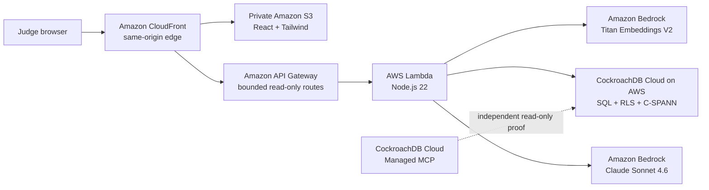

# Archon Memory Control Room

**A Financial Memory Control Room that lets a CFO ask what the books forgot,
inspect the exact evidence behind the answer, and see when persistent memory
disagrees with itself.**

This is the CockroachDB AI Challenge entry at
[upgradedev/archon-cockroach-memory](https://github.com/upgradedev/archon-cockroach-memory).
It uses CockroachDB as durable, distributed agent memory and AWS Bedrock for
embeddings and grounded narration.

## Working challenge slice

The working challenge slice is intentionally precise:

- One fixed synthetic company: **Helios SA**.
- A public, read-only investigation surface; callers cannot select a tenant,
  company, database, model, or write tool.
- Persistent memories stored beside provenance and lifecycle state.
- Native C-SPANN semantic recall, filtered by tenant, embedding model, active
  lifecycle state, and company.
- A cited Bedrock answer with relevance abstention, per-claim citation checks,
  numeric checks, and deterministic evidence fallback.
- A complete-scope, read-only audit for contradictions and missing counterparts.
- A live proof ledger for database version, runtime principal, active record
  count, vector index, models, and fixed scope.

The broader Archon document-extraction and financial-reconciliation platform is
product vision and reusable domain context; it is not presented as functionality
of this judge-facing application.

## Why this is agentic memory

An ordinary RAG demo retrieves chunks from a static corpus. Archon Memory keeps
durable facts learned across independent sessions and makes their state explicit:

1. A learned fact has an idempotency key, content hash, provenance, embedding
   model, status, timestamps, and optional supersession link.
2. A later question recalls only compatible, active evidence through CockroachDB's
   native distributed vector index.
3. The answer cites exact stored memories; unsupported or weakly related evidence
   causes abstention or deterministic fallback.
4. A separate exhaustive audit compares the memory across sessions and surfaces
   contradictions and dangling references without mutating the data.

The differentiator is simple: **the memory can disagree out loud before an agent
acts on it.**

## Architecture


```mermaid
flowchart LR
    Judge["Judge browser"]
    CF["Amazon CloudFront<br/>same-origin edge"]
    S3["Private Amazon S3<br/>React + Tailwind"]
    API["Amazon API Gateway<br/>bounded read-only routes"]
    Lambda["AWS Lambda<br/>Node.js 22"]
    Titan["Amazon Bedrock<br/>Titan Embeddings V2"]
    Claude["Amazon Bedrock<br/>Claude Sonnet 4.6"]
    CRDB["CockroachDB Cloud on AWS<br/>SQL + RLS + C-SPANN"]
    MCP["CockroachDB Cloud<br/>Managed MCP"]

    Judge --> CF
    CF --> S3
    CF --> API --> Lambda
    Lambda --> Titan
    Lambda --> CRDB
    Lambda --> Claude
    MCP -. "independent read-only proof" .-> CRDB
```

The application workload is fixed to `eu-west-1`. CloudFront is a global AWS edge
service; it does not reintroduce an application workload in `us-west-2`.

## Required CockroachDB tools: 2 of 4

The entry uses the two required tools below. It does not count ccloud or the
self-hosted MCP surface toward this total.

### 1. Distributed Vector Indexing

`agent_memory.embedding VECTOR(1024)` is indexed by CockroachDB-native
`CREATE VECTOR INDEX ... vector_cosine_ops`. This is C-SPANN, not the pgvector
extension.

Production recall equality-constrains:

- `tenant_id`
- `embed_model`
- `status = 'active'`
- `company = 'Helios SA'`

The schema contains benchmark-oriented global indexing plus two production
prefix indexes: company-wide recall and company+kind recall. Because CockroachDB
v26.2 represents RLS as an optimizer barrier, the production paths run through
two dematerialized, fixed-scope serving views. The database release uses the
exact application query to `EXPLAIN` and execute both paths as the real staging
and production principals, then probes both views with the three isolation
canary vectors while reasserting every prefix equality required for a legal
C-SPANN search. Separate exact catalog, owner, grant, and view-definition checks
prove the fixed boundary. `EXPLAIN` evidence, recall@k measurements,
multi-range fan-out, RF=3 distribution, and node-loss survival are recorded in
[docs/BENCHMARK.md](./docs/BENCHMARK.md) and
[docs/CLOUD_SMOKE.md](./docs/CLOUD_SMOKE.md).

### 2. CockroachDB Cloud Managed MCP

The hardened receipt-schema-v2 audit uses exactly four hosted, read-only Managed
MCP calls for cluster identity, table listing, schema inspection, and one
fixed-scope aggregate. Its SQL is pinned to
`public-demo / Helios SA / active / amazon.titan-embed-text-v2:0`, forces
`idx_agent_memory_active_scope`, reads through a ten-row sentinel, returns at
most one aggregate row, and accepts only the exact `9 / 9 / 9` Store proof.
Credentials, cluster identifiers, connection material, memory text, and
embeddings are never emitted.

[Deploy AWS run 30144685107](https://github.com/upgradedev/archon-cockroach-memory/actions/runs/30144685107)
is historical pre-hardening evidence: it proves live Managed MCP connectivity and
the four tool surfaces, but predates receipt schema v2 and therefore does not
prove the new exact scope, bound, parser, or `9 / 9 / 9` gate. The v2 claim
becomes live evidence only after a new protected workflow run passes.

Evidence and the reproducible operator path:

- [docs/MANAGED_MCP_SMOKE.md](./docs/MANAGED_MCP_SMOKE.md)
- [scripts/cloud-mcp-audit.ts](./scripts/cloud-mcp-audit.ts)
- [.github/workflows/managed-mcp-audit.yml](./.github/workflows/managed-mcp-audit.yml)

### Additional, not counted

- `src/mcp/server.ts` exposes application-level `remember_memory`,
  `recall_memory`, and `audit_memory` tools for MCP-speaking agents.
- `scripts/provision-cluster.sh` contains current ccloud Basic-cluster operator
  automation. ccloud is not counted until an authenticated ccloud receipt exists.

The canonical tool inventory is [docs/TOOLS.md](./docs/TOOLS.md).

## AWS implementation

The deployment follows the AWS serverless web application reference pattern:

- Private, encrypted, versioned S3 origin. The delivery foundation defines one
  BOE/SSE-S3, versioned server-access-log archive with exact artifact,
  staging-web, and production-web source/prefix grants. Artifact logging is
  enabled through a protected first activation; staging and production logging
  follow only after that live prerequisite is proved. The archive deliberately
  does not log to itself; an exact-resource, terminal Security Hub S3.9
  automation rule records and suppresses only that recursive-logging exception.
- CloudFront Origin Access Control, same-origin `/api/*`, HTTP/2+3, compression,
  CSP/HSTS/security headers, and SPA routing.
- API Gateway HTTP API with a named `live` stage, stage-wide throttling,
  detailed metrics, vended CloudWatch access logs, no per-route overrides, and
  no public mutation route.
- Lambda Node.js 22 with reserved concurrency, X-Ray, retained logs, and bounded
  request/retrieval work.
- Secrets Manager stores the least-privilege CockroachDB connection under a
  deterministic environment name; the URI is never a Lambda environment
  variable, GitHub secret, or CloudFormation parameter.
- Titan Text Embeddings V2 creates normalized 1024-dimensional vectors.
- Claude Sonnet 4.6 narrates from untrusted evidence through Bedrock Converse.
- A candidate-version-scoped CodeDeploy alarm isolates the exact
  `ExecutedVersion` behind the weighted alias; separate function/API/throttle
  alarms and an operations dashboard retain broad operational coverage.

The infrastructure is defined in [aws/template.yaml](./aws/template.yaml).
Real eu-west-1 Bedrock proof is captured in
[docs/BEDROCK_SMOKE.md](./docs/BEDROCK_SMOKE.md).

## CI/CD

The release path is source-controlled:

```text
secret scan
  → dependency gates
  → TypeScript/unit/integration/security/load/node-loss tests
  → React unit + desktop/mobile Playwright
  → SAM lint/build
  → source-readiness gate
  → build once
  → cryptographic candidate receipt
  → protected database release (exact legacy supersession + payload-digest proof + fail-closed RLS + two-principal C-SPANN probes)
  → exact, integrity-bound application S3 logging preflight and scoped delivery-role read proof
  → identical preflight replay immediately before any SAM mutation
  → OIDC staging deploy + candidate-scoped 10%/5m proof-and-recall canary
  → processed-template + live EventTime S3 logging proof before frontend mutation
  → processed-template + live named-stage throttle/metrics/vended-log proof
  → full real recall smoke + hosted Playwright
  → identical-candidate production promotion
  → candidate-scoped canary + named-stage proof + full recall + hosted Playwright
  → recover and re-prove the exact previous S3 logging state, CloudFormation
    template/JSON parameters, traffic alias, versioned S3 index, and public
    health/proof on any post-deploy failure; `RetainExceptOnCreate` prevents
    initial-rollback debris, and the retry-safe greenfield cleanup deletes its
    stack plus bounded retained bucket versions/log groups
```

Supply-chain references are immutable commit/image digests. Staging, production,
and database-operator OIDC subjects are bound to their GitHub environments.
Bootstrap owns the environment-specific Lambda and CodeDeploy roles, retained
S3 log archive, narrow S3.9 exception, and a versioned artifact bucket; the SAM
application stack is CI-gated to synthesize no IAM resources. Those resources
are defined in [aws/bootstrap-oidc.yaml](./aws/bootstrap-oidc.yaml).

The existing bootstrap stack remains unbound from any persistent CloudFormation
service role. Its one-time administrator update creates the archive and policy
with artifact logging explicitly disabled. The protected
`Bootstrap AWS Foundation` workflow then uses a claim-bound, activation-only
OIDC role and separate `plan`/`apply` dispatches. It accepts only the current
40-character green main SHA, pins a versioned template by SHA-256, and executes
only the immutable ARN of one inspected, non-replacement
`ArtifactBucket.LoggingConfiguration` change. Explicit bounded plan,
activation, unverified-plan cleanup, and recovery pollers fit inside the
protected job budget. The role
cannot mutate IAM/Security Hub, delete a stack, or directly call
`PutBucketLogging` outside CloudFormation because that permission is FAS-bound
to `cloudformation.amazonaws.com`. CloudFormation's in-place update can resolve
only the ten exact role ARNs referenced through foundation `GetAtt`
expressions and the exact Security Hub automation-rule tags; those read actions
are also FAS-bound to `cloudformation.amazonaws.com`.

The Phase-2 application release refuses to
mutate either stack until the stored bootstrap parameter, live EventTime
foundation, and an integrity-bound source-bucket preflight all agree. It repeats
that preflight immediately before SAM, cross-binds greenfield/existing stack
state to absent/enabled bucket state, then proves the processed template and
exact live source configuration before any frontend mutation. Raw preflight and
proof hashes remain bound through receipt publication; recovery proves the
restored enabled, disabled, or greenfield-absent state. Staging and production
deploy identities retain only the narrow read permissions needed for those
proofs.

Each environment preflights its permissions before SAM is allowed to mutate its
stack. HTTP API delivery uses
`/aws/vendedlogs/apigateway/*`, while the legacy log-group logical resource stays
managed solely to keep exact-template rollback collision-free.

This repository does **not** call the pipeline “live-complete” merely because
the YAML exists. Full CI/CD is established only after main CI, staging,
protected database release, staging, production, hosted E2E, Managed MCP audit,
and deployment receipts have all completed successfully.

## Security and trust boundaries

- CockroachDB RLS is bound to the `archon_public_reader` role and the exact
  `public-demo / Helios SA / active` scope. It does not trust mutable
  `application_name` as an identity.
- The Lambda principals remain `NOBYPASSRLS`. Only
  `archon_public_memory_view_owner` has the direct, non-inheritable
  `BYPASSRLS` role option required by CockroachDB v26.2.3; it has no system
  privileges, is `NOLOGIN`, has no members, receives only `SELECT` on
  `agent_memory`, owns only the two fixed-predicate serving views, and ends
  migration without `CREATE` authority on the schema.
- Initial provisioning creates a dedicated login that inherits the NOLOGIN
  reader role. Existing secrets fail closed; credential rotation is not claimed
  until an explicit two-principal pending/activate/retire workflow is implemented.
- The public API accepts recall questions only in JSON `POST` bodies; questions
  never enter URLs or access logs.
- Request bytes, question length, top-k, audit scan, API rate, concurrency, and
  model calls are bounded.
- Database/AWS exceptions are redacted; Lambda failures still reach native error
  metrics. The deployment alarm uses the weighted alias plus its exact candidate
  `ExecutedVersion`, so both proof and recall can run throughout the canary
  without old-version failures blocking a recovery. Full recall remains a
  mandatory post-promotion gate with explicit alias and versioned-S3
  restoration.
- Memory text is escaped and treated as untrusted evidence, never as instructions.
- The public database is a dedicated synthetic demonstration scope; no customer
  records are used.

## Why CockroachDB instead of DynamoDB or Cosmos DB?

| Need in this project | CockroachDB | DynamoDB | Cosmos DB |
|---|---|---|---|
| Relational financial truth, constraints, joins | Native distributed SQL | Application-side modeling | Primarily NoSQL modeling |
| Serializable multi-row transactions | Default SQL transaction model | Supported with Dynamo-specific limits | Scope/feature dependent |
| Vector beside the same transactional records | Native vector column/index | Commonly paired with OpenSearch | Native vector capabilities |
| PostgreSQL-wire portability | Yes | No | No |
| Cloud-neutral distributed data layer | Yes | AWS-native | Azure-native |

DynamoDB is the natural choice when AWS-native key-value access and operational
simplicity dominate. Cosmos DB is strong for Azure-native globally distributed
document/vector workloads. CockroachDB fits this project because relational
financial truth, provenance, lifecycle, audit, and vector memory can live in one
serializable distributed database without splitting truth across systems.

The “memory” in the Qwen projects is an application-level memory lifecycle over a
database. CockroachDB is the database substrate here. Archon borrows mature
memory patterns—idempotency, supersession, feedback/consistency signals—and adds
role-bound distributed SQL consistency and native vector retrieval.

## Quickstart

Requirements: Node.js 22+, Docker, and npm.

```bash
npm ci
docker compose up -d --wait
npm run local:bootstrap
```

`local:bootstrap` is loopback-only and add-only. It creates the dedicated local
database, applies the schema, seeds the deterministic nine public fixtures plus
three RLS isolation canaries, preserves unrelated rows, and proves the exact
`12/12/12` fixture contract. Builds and tests remain CI-owned.

The frontend has its own locked workspace:

```bash
npm ci --prefix web
npm test --prefix web
npm run test:e2e --prefix web
```

Repository policy runs build and browser verification in CI. Do not commit
`node_modules`, `dist`, `.aws-sam`, Playwright output, readiness output, or
generated video assets.

## Current evidence state

| Evidence | State |
|---|---|
| Live CockroachDB Cloud Basic cluster, AWS `eu-west-1` | Verified |
| Historical native-vector plans / recall benchmark | Verified |
| Runtime-principal company + kind C-SPANN serving gate | Verified in the [latest exact-SHA protected release](https://github.com/upgradedev/archon-cockroach-memory/actions/runs/30144685107) |
| Live bounded Store proof: persistence + unique keys + payload-bound SHA-256 digests | Verified 9/9/9 in the [same release](https://github.com/upgradedev/archon-cockroach-memory/actions/runs/30144685107) and exposed read-only in `/api/proof` |
| CockroachDB Cloud Managed MCP | Historical live read-only connectivity/tool proof in [run 30144685107](https://github.com/upgradedev/archon-cockroach-memory/actions/runs/30144685107); hardened exact-scope receipt v2 is source/CI-gated and awaits a new protected live run |
| Real Titan V2 + Claude Sonnet 4.6 in `eu-west-1` | Verified |
| Control Room, protected DB release, zero-IAM SAM stack, OIDC CI/CD, canary/rollback | Verified end to end |
| Unrestricted CloudFront production URL and hosted receipts | [Live and verified](https://d2s5v0o0eg2aaw.cloudfront.net) |
| Legacy `us-west-2` Lambda/log/IAM workload | Retired after verified cutover; [scoped inventory](./docs/DEMO_URL.md) is empty |
| `main` governance | [Active ruleset](https://github.com/upgradedev/archon-cockroach-memory/rules/19722191): PR only, no force-push/delete, strict `readiness` + CodeQL |
| Final public video, post, and Devpost form | Deliberately last |

Run `npm run readiness` for separate source-readiness and submission-eligibility
results. A source-ready result never implies that the final video/form is done.

## Prior-work disclosure

The **pre-existing** work is the Archon financial domain, synthetic Helios
scenario, extraction/reconciliation concepts, and the relational table shapes for
documents, employees, payroll events, and validations. Those ideas and selected
schema/extraction code were adapted from the earlier Archon/Nebius work.

The **challenge-period** implementation is the CockroachDB `agent_memory` layer,
native vector/prefix indexes, fixed-scope C-SPANN serving views, idempotency and
lifecycle model, role-bound RLS,
recall/audit/proof APIs, grounded narrator guards, live Managed MCP integration,
React Control Room, AWS serverless architecture, OIDC promotion/rollback
pipeline, and the new verification suites.

Patterns from the Qwen, Nebius Serverless, Microsoft Agents League, Google
Vibecoding, OpenAI Build Week, Kerdon, and Backblaze projects informed design
choices such as evidence receipts, explicit authority, lifecycle state, and
deterministic verification. No other challenge entry is represented as new code
here unless it is present in this repository and disclosed above.

## License

[MIT](./LICENSE)
