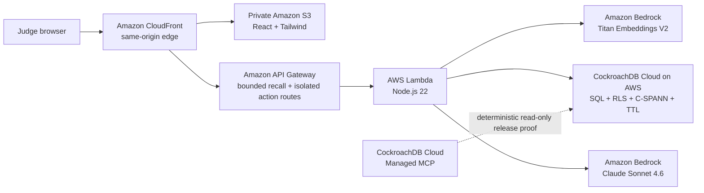

# Archon Memory Control Room

**A Financial Memory Control Room that lets a CFO ask what the books forgot,
inspect the exact evidence, and see persistent memory disagree — without giving
the agent financial authority.** Explicitly resolving a correction is the
[Memory Resolution Loop](#on-main-not-in-the-deployed-baseline): implemented and
CI-covered on `main`, but not part of the deployed baseline a judge can reach
today.

This is an entry for the
[CockroachDB × AWS Hackathon — Build with Agentic Memory](https://cockroachdb-ai.devpost.com/)
at
[upgradedev/archon-cockroach-memory](https://github.com/upgradedev/archon-cockroach-memory).
It uses CockroachDB as durable, distributed agent memory and AWS Bedrock for
embeddings and grounded narration.

## Current demo status — 2026-08-04

**The hosted demo's data plane is down.** `/api/health` still answers 200, but it
is a reachability stub that reports `"dependencies":"unchecked"`. `/api/proof`,
`/api/audit`, and `POST /api/recall` have returned HTTP 500 since 2026-08-02
11:20 UTC; the last successful data-plane response was 2026-07-31 01:22 UTC. The
CockroachDB Cloud Basic cluster reached its Request Unit allowance and is
disabled, so the runtime principal is refused with `the maximum number of
allowed connections is 0`.

This is a cluster budget state, not a code or deployment regression. None of the
hosted evidence in this README or in [docs/DEMO_URL.md](./docs/DEMO_URL.md)
depends on the demo being reachable: each link is a completed GitHub Actions run
bound to an exact commit, and those runs remain viewable. A judge opening the URL
today should expect the interface to load and its data panels to error.

## Working challenge slice

The working challenge slice is intentionally precise:

- One fixed synthetic company: **Helios SA**.
- A public investigation surface over read-only canonical memory; callers
  cannot select a tenant, company, database, model, or canonical write tool.
- Persistent memories stored beside provenance and lifecycle state.
- Native C-SPANN semantic recall, filtered by tenant, embedding model, active
  lifecycle state, and company.
- A cited Bedrock answer with relevance abstention, per-claim citation checks,
  numeric checks, and deterministic evidence fallback.
- A complete-scope, read-only audit for contradictions and missing counterparts.
- Explicit learning, consolidation, and CockroachDB row-level TTL forgetting
  policies, with no external financial side effect.
- A live proof ledger for database version, runtime principal, active record
  count, vector index, models, and fixed scope.

The broader Archon document-extraction and financial-reconciliation platform is
product vision and reusable domain context; it is not presented as functionality
of this judge-facing application.

### On `main`, not in the deployed baseline

The **Memory Resolution Loop** — a disposable sandbox that observes a
cross-session correction, requires an explicit synthetic controller decision,
applies one serializable/idempotent CockroachDB state transition, and returns an
immutable receipt — is implemented and CI-covered on `main`
([docs/MEMORY_RESOLUTION_LOOP.md](./docs/MEMORY_RESOLUTION_LOOP.md),
`src/memory/resolution.ts`, `src/http/resolution-handler.ts`,
`web/src/components/MemoryResolutionLoop.tsx`).

It is not part of the deployed production baseline. Commit `0b25d5f` contains
none of those files, and the deployed API answers `/api/resolution/session` with
404. It reaches the judge-facing application only once a release chain deploys a
commit that carries it, so a judge cannot exercise it at the demo URL today.

## Why this is agentic memory

An ordinary RAG demo retrieves chunks from a static corpus. Archon Memory keeps
durable facts learned across independent sessions and makes their state explicit:

1. A learned fact has an idempotency key, content hash, provenance, embedding
   model, status, timestamps, and optional supersession link.
2. A later question recalls only compatible, active evidence through CockroachDB's
   native distributed vector index.
3. The answer cites exact stored memories; unsupported or weakly related evidence
   causes abstention or deterministic fallback.
4. A separate exhaustive audit compares the memory across sessions and surfaces
   contradictions and dangling references without mutating canonical data.
5. A bounded sandbox can propose a higher-authority correction, wait for a
   human click, preserve both sources, consolidate current/superseded state, and
   expire the disposable graph through CockroachDB TTL.

The differentiator is simple: **the memory can disagree out loud before an agent
acts on it.**

The working loop is **Store → Retrieve → Act**: `ingestEvent`/`remember`
idempotently persist embedded facts, provenance, content digests, and lifecycle
state; native C-SPANN retrieves only the fixed active scope; the agent returns a
cited answer, abstains, uses deterministic evidence wording, or proposes a
correction. The judge-facing action is real but deliberately narrow: only an
explicit human can commit the fixed synthetic resolution graph, while
`agent_memory` remains read-only.

## Architecture


```mermaid
flowchart LR
    Judge["Judge browser"]
    CF["Amazon CloudFront<br/>same-origin edge"]
    S3["Private Amazon S3<br/>React + Tailwind"]
    API["Amazon API Gateway<br/>bounded recall + isolated action routes"]
    Lambda["AWS Lambda<br/>Node.js 22"]
    Titan["Amazon Bedrock<br/>Titan Embeddings V2"]
    Claude["Amazon Bedrock<br/>Claude Sonnet 4.6"]
    CRDB["CockroachDB Cloud on AWS<br/>SQL + RLS + C-SPANN + TTL"]
    MCP["CockroachDB Cloud<br/>Managed MCP"]

    Judge --> CF
    CF --> S3
    CF --> API --> Lambda
    Lambda --> Titan
    Lambda --> CRDB
    Lambda --> Claude
    MCP -. "deterministic read-only release proof" .-> CRDB
```

Regional AWS application resources and API entry points, plus the CockroachDB
cluster, are anchored in `eu-west-1`; CloudFront is global and Claude uses an EU
cross-region inference profile. The scoped inventory contains no application
resources in `us-west-2`.

## Two meaningfully integrated CockroachDB tools

The entry has one CockroachDB memory data plane and one independent
CockroachDB control plane. The Financial Memory Agent uses Distributed Vector
Indexing for live recall. The Memory Integrity Agent uses Cloud Managed MCP to
inspect the same release and blocks application promotion unless its exact
Store and C-SPANN evidence is verified. It does not count ccloud or the
self-hosted MCP surface toward the challenge minimum.

### 1. Distributed Vector Indexing

`agent_memory.embedding VECTOR(1024)` is indexed by CockroachDB-native
`CREATE VECTOR INDEX ... vector_cosine_ops`. This is C-SPANN, not the pgvector
extension.

Production recall equality-constrains:

- `tenant_id`
- `embed_model`
- `status = 'active'`
- `company = 'Helios SA'`

The schema contains benchmark-oriented global indexing plus two production
prefix indexes: company-wide recall and company+kind recall. Because CockroachDB
v26.2 represents RLS as an optimizer barrier, the production paths run through
two dematerialized, fixed-scope serving views. The database release uses the
exact application query to `EXPLAIN` and execute both paths as the real staging
and production principals, then probes both views with the three isolation
canary vectors while reasserting every prefix equality required for a legal
C-SPANN search. Separate exact catalog, owner, grant, and view-definition checks
prove the fixed boundary. `EXPLAIN` evidence, recall@k measurements,
multi-range fan-out, RF=3 distribution, and node-loss survival are recorded in
[docs/BENCHMARK.md](./docs/BENCHMARK.md) and
[docs/CLOUD_SMOKE.md](./docs/CLOUD_SMOKE.md).

### 2. CockroachDB Cloud Managed MCP

The hardened receipt-schema-v3 Memory Integrity Agent uses four required
hosted, read-only Managed MCP calls for cluster identity, table listing, schema
inspection, and one fixed-scope aggregate. When the hosted server advertises
`explain_query`, it also requires that optional read-only call to prove
`idx_agent_memory_company_scope_embedding`; an advertised capability that
cannot prove the exact C-SPANN plan fails closed. When the capability is not
advertised, the receipt says `not-advertised` and links instead to the exact-SHA
database-release C-SPANN receipt digest—there is no fabricated tool use.

The aggregate SQL is pinned to
`public-demo / Helios SA / active / amazon.titan-embed-text-v2:0`, forces
`idx_agent_memory_active_scope`, reads through a ten-row sentinel, returns at
most one aggregate row, and accepts only the exact `9 / 9 / 9` Store proof. The
v3 receipt binds the 40-character release SHA, the database C-SPANN receipt
SHA-256, the exact Managed MCP tool sequence, and—when available—only a query
plan fingerprint. Credentials, cluster identifiers, connection material,
memory text, embeddings, and raw plans are never emitted.

This is a causal gate, not a terminal report: the protected database release
must complete first, Managed MCP must then verify it, and both staging and
production explicitly depend on that successful job. A separate protected
standalone audit reuses the same v3 contract and exact release evidence.

Receipt schema v3 is the contract implemented in
[`scripts/cloud-mcp-audit.ts`](./scripts/cloud-mcp-audit.ts) and asserted by the
[Managed MCP audit](./.github/workflows/managed-mcp-audit.yml) workflow as it
stands on `main`. **No hosted run has produced a v3 receipt.** The workflow at
the deployed baseline commit `0b25d5f` asserts `schemaVersion == 2`, and every
Managed MCP receipt recorded as evidence so far — including the deployed
baseline's — is v2. [docs/MANAGED_MCP_SMOKE.md](./docs/MANAGED_MCP_SMOKE.md)
draws the same boundary.

[Deploy AWS run 30144685107](https://github.com/upgradedev/archon-cockroach-memory/actions/runs/30144685107)
is historical pre-hardening evidence: it proves live Managed MCP connectivity and
the four tool surfaces, but predates receipt schema v2 and therefore does not
prove the new exact scope, bound, parser, or `9 / 9 / 9` gate. The hardened v2
contract subsequently passed in
[Deploy AWS run 30204081177](https://github.com/upgradedev/archon-cockroach-memory/actions/runs/30204081177)
at exact commit
[`a2b69e3fad31010d14d0c3bca261421e635ca885`](https://github.com/upgradedev/archon-cockroach-memory/commit/a2b69e3fad31010d14d0c3bca261421e635ca885),
including the bounded live proof, exact receipt gate, and sanitized
`managed-mcp-production-a2b69e3fad31010d14d0c3bca261421e635ca885` artifact.

Evidence and the reproducible operator path:

- [docs/MANAGED_MCP_SMOKE.md](./docs/MANAGED_MCP_SMOKE.md)
- [scripts/cloud-mcp-audit.ts](./scripts/cloud-mcp-audit.ts)
- [.github/workflows/managed-mcp-audit.yml](./.github/workflows/managed-mcp-audit.yml)

### Additional, not counted

- `src/mcp/server.ts` exposes application-level `remember_memory`,
  `recall_memory`, and `audit_memory` tools for MCP-speaking agents.
- `scripts/provision-cluster.sh` contains current ccloud Basic-cluster operator
  automation. ccloud is not counted until an authenticated ccloud receipt exists.

The canonical tool inventory is [docs/TOOLS.md](./docs/TOOLS.md).

## AWS implementation

The deployment follows the AWS serverless web application reference pattern:

- Private, encrypted, versioned S3 origin. The delivery foundation defines one
  BOE/SSE-S3, versioned server-access-log archive with exact artifact,
  staging-web, and production-web source/prefix grants. Artifact logging is
  enabled through a protected first activation; staging and production logging
  follow only after that live prerequisite is proved. The archive deliberately
  does not log to itself; an exact-resource, terminal Security Hub S3.9
  automation rule records and suppresses only that recursive-logging exception.
- CloudFront Origin Access Control, same-origin `/api/*`, HTTP/2+3, compression,
  CSP/HSTS/security headers, and SPA routing.
- API Gateway HTTP API with a named `live` stage, stage-wide throttling,
  detailed metrics, vended CloudWatch access logs, no per-route overrides,
  read-only canonical routes, and a fixed synthetic TTL-scoped resolution
  route.
- Lambda Node.js 22 with five bounded in-flight slots: three initial Control
  Room evidence reads, one recall, and one spare. API request-rate and burst
  limits are enforced independently; X-Ray, retained logs, and bounded
  request/retrieval work remain enabled.
- Secrets Manager stores the least-privilege CockroachDB connection under a
  deterministic environment name; the URI is never a Lambda environment
  variable, GitHub secret, or CloudFormation parameter.
- Titan Text Embeddings V2 creates normalized 1024-dimensional vectors.
- Claude Sonnet 4.6 narrates from untrusted evidence through Bedrock Converse.
- A candidate-version-scoped CodeDeploy alarm isolates the exact
  `ExecutedVersion` behind the weighted alias; separate function/API/throttle
  alarms and an operations dashboard retain broad operational coverage.

### Alarm routing — protected activation and staging drill path

The delivery foundation now source-controls a fail-closed alarm-routing
contract plus a manual `plan|apply|verify|drill` control workflow, but it is
deliberately **not claimed as live** until hosted receipts exist. Its
`AlarmRoutingEnabled` parameter defaults to `false`; no SNS topic ARN is guessed
or prewired, and the deploy workflow no longer accepts an
`ALARM_TOPIC_ARN` GitHub secret. A separately authorized administrator must
first approve the billable AWS resources and cross the protected
`alarm-routing-controls` environment. The dedicated repository-bound OIDC role
can submit only an immutable exact-SHA template to the existing foundation
stack, pass only the dedicated CloudFormation execution role, and execute only
an inspected `AlarmRoutingEnabled=false -> true` change set. Both plan and
apply reject any replacement, deletion, or mutation of an existing resource;
the only accepted plan adds the 15 conditional alarm resources. The existing
foundation-promotion and deploy roles cannot silently self-activate the
contract.

When activated, the foundation creates one rotating customer-managed KMS key,
separate encrypted staging/production SNS topics, separate encrypted 14-day
SQS operational archives, and a five-minute KMS-encrypted staging drill queue
whose SNS payload filter accepts only the synthetic probe's exact `AlarmName`.
The probe is not attached to CodeDeploy. CloudWatch publishing, SNS queue delivery, deploy-role
inspection, non-SNS producer denial, TLS enforcement, resource tags, retention,
and archive subscriptions are all exact-resource policies protected against
replacement or deletion. Each deployment discovers only complete foundation
outputs before SAM mutation. A pre-contract foundation is reported distinctly
as `legacy-inactive-not-provisioned`, supplies no topic ARN, and explicitly
passes a complete parameter map from `${RUNNER_TEMP}` through SAM's `file://`
YAML interface, with an empty `AlarmTopicArn`, so an existing stack cannot
retain a stale destination. It remains guarded by the existing pre/post
CloudFormation drift gates. After the exact foundation template has been
synchronized, its
unconditional read-only alarm-inspection policy lets every deployment prove
that exactly four deployment alarms either route exclusively to the discovered
topic or, while the contract is disabled, retain no actions at all. In the
active staging state it additionally verifies the isolated routing probe. Any partial,
inconsistent, cross-environment, or stale-action contract fails closed. The SQS
archives are finite 14-day
delivery/evidence buffers, not immutable records or human-notification
endpoints; without a separately approved consumer, messages expire. The drill
can force only the synthetic staging probe from `ALARM` to `OK`, observe the
matching encrypted SNS-to-SQS envelope in the dedicated filtered queue without
reading the operational archive or deleting the message, and bind hashed
human approval/acknowledgement references without contact details. Its IAM
authority cannot set production alarm state. This proves the encrypted probe route,
not delivery to or acknowledgement by a paging destination. Human paging and
all live activation/drill claims remain pending until separately approved
hosted receipts exist.

### Durable AWS delivery recovery — live protected rollout

The repository contains the source-controlled workflow, scripts, strict receipt
validators, finalizer, tests, and readiness rules for surviving loss or
cancellation of the original GitHub Actions runner. Initial AWS activation was
proved at the historical exact protected code-bearing commit
[`8c09b7ee07f1a3a0cd8ea19bf1db900c992e3edf`](https://github.com/upgradedev/archon-cockroach-memory/commit/8c09b7ee07f1a3a0cd8ea19bf1db900c992e3edf):
[main CI](https://github.com/upgradedev/archon-cockroach-memory/actions/runs/30331668301),
[CodeQL](https://github.com/upgradedev/archon-cockroach-memory/actions/runs/30331668308),
the complete protected
[Deploy AWS run](https://github.com/upgradedev/archon-cockroach-memory/actions/runs/30331875727/attempts/2),
and the automatic post-deploy
[Recover AWS classification](https://github.com/upgradedev/archon-cockroach-memory/actions/runs/30333619982)
all succeeded. Both recovery ledgers ended terminal `COMMITTED`, bound to the
exact candidate/run/attempt and immutable receipt, with no lease left active.
The automatic watchdog then proved the successful source run required no
restoration. This is not presented as an intentionally fault-injected
`RECOVERED`/finalizer drill.

The S3 CAS data plane uses the private, versioned artifact bucket. Deployment
objects are isolated under
`candidates/deployments/<environment>/`, while each delivery role can access
only its own `candidates/recovery/<environment>/` objects, so no new recovery
database or cross-environment recovery authority is required. CloudFormation
and CodeDeploy retain temporary read-only access to the exact legacy
`candidates/<40-character-id>/` shape so the first post-migration rollback can
still consume the prior immutable revision; no role can write or list that
legacy namespace.

The bootstrap template also contains the required `Recover AWS` OIDC trust and
least-privilege CloudFormation, S3, Logs, Lambda, and CloudFront actions.
The `Bootstrap AWS Foundation` promotion path remains intentionally limited to
the exact artifact-bucket logging change and cannot grant IAM authority. The
separately authorized IAM promotion for the exact commit above used the
Git template pinned to SHA-256
`c3408ed4805ddffe7f969b72fce7d5ccc6c88b41c6bd33379b13d708deda5142`,
inspected exactly three direct in-place
`AWS::IAM::ManagedPolicy` document changes, and contained no replacement,
addition, deletion, or non-IAM mutation. The foundation finished
`UPDATE_COMPLETE`; its live default policy versions contain the required drift
discovery actions, its post-promotion drift result is `IN_SYNC`, and termination
protection is enabled. Future IAM changes still require separate authorization.

The checked-in control plane is AWS-native and fixed to `eu-west-1`:

1. Immediately before the first application mutation, CI creates a data-only
   recovery archive containing the exact prior CloudFormation
   template/parameters/tags, Lambda `live` alias, frontend index bytes and
   metadata, and S3 logging preflight. The archive is written only under
   `${RUNNER_TEMP}` and conditionally created under the private, encrypted,
   versioned `candidates/recovery/<environment>/` prefix.
2. The immutable object is checksum-bound to its intent. CI re-reads and
   validates the archive and manifest SHA-256 values before any application
   mutation; extraction treats every member as untrusted data.
3. A fixed environment ledger object in the same prefix is created with
   `If-None-Match: *` and advanced with `If-Match: <current ETag>`. Those S3
   conditional writes provide the compare-and-swap fence for
   `ARMED → COMMITTED` or `ARMED → RECOVERING → RECOVERED`. Each revision binds
   the candidate, source CI and deploy run identities, immutable bundle
   identity, digests, intent ID, lease, and prior ledger revision.
4. A successful terminal deployment receipt advances the same intent to
   `COMMITTED`. A completely proved restoration may advance it to `RECOVERED`;
   cancellation and incomplete recovery leave it unresolved.
5. The checked-in watchdog handles failed, cancelled, and timed-out delivery
   runs from a 15-minute schedule, a daily audit schedule, or manual dispatch.
   It classifies only the exact `Deploy AWS` push run/attempt bound by the
   durable ledger. A two-hour lease is bound to the exact watchdog
   run/attempt/environment. An active owner blocks competing work; an expired
   lease or an exactly proved completed non-success owner can be reclaimed
   through another CAS revision.
6. Recovery emits a strict `archon.durable-recovery.receipt` schema-v2 object.
   It embeds sanitized target, executor, archive, exact `RECOVERING` ledger, and
   restored stack/logging/frontend/alias/live proofs. The verifier cross-checks
   those fields against the immutable manifest and exact ledger revision.
7. The idempotent finalizer validates the v2 receipt and the post-recovery
   CloudFormation control proof, conditionally creates both checksum-addressed
   S3 objects, and reads back their exact versions with byte, SHA-256, S3
   checksum, encryption, content-type, and metadata checks. Only then does it
   CAS-advance the same lease from `RECOVERING` to `RECOVERED`, binding both
   immutable object identities into the terminal ledger. An ambiguous retry
   succeeds only if the already-terminal ledger has the exact receipt, control
   proof, and previous-ledger binding.
8. Existing stacks are bound to exact StackId/name/account/region, stable
   status, execution role, revision, and canonical tag digest. Preflight and
   terminal gates enable and re-prove termination protection when necessary,
   then run fresh bounded drift detection. Recovery applies the same gate to a
   restored stack or proves exact greenfield absence. The read-only protection
   audit requires protection already enabled and runs fresh drift detection
   daily at `04:17 UTC` when no recovery is pending. The same audit can be
   replayed from the current trusted `main` SHA with the explicit
   `workflow_dispatch` `operation=audit` input; stale workflow reruns remain
   rejected by the source-identity gate.

The watchdog uses trusted `main` recovery code, the exact `staging` or
`production` GitHub environment and its OIDC subject, and refreshed one-hour
credentials for the long recovery and finalization boundaries. It does not
depend on files or credentials from the failed runner. Bundle creation,
extraction, validation, finalization, and recovery simulation are CI-owned; no
generated recovery archive, receipt, extraction directory, or build output
belongs in the repository.

The infrastructure is defined in [aws/template.yaml](./aws/template.yaml).
Real eu-west-1 Bedrock proof is captured in
[docs/BEDROCK_SMOKE.md](./docs/BEDROCK_SMOKE.md).

## CI/CD

The release path is source-controlled:

```text
secret scan
  → dependency + pipeline-only supply-chain gates, SBOMs, licenses, IaC and workflow scanners
  → TypeScript/unit/integration/security/load/node-loss tests
  → longitudinal B0–B4 baselines, lifecycle ablations, 100k-event rehearsal,
    and real C-SPANN-versus-exact evaluation
  → React unit + desktop/mobile Playwright
  → SAM lint/build
  → source-readiness gate
  → build once
  → cryptographic candidate receipt
  → protected database release (exact legacy supersession + payload-digest proof + fail-closed RLS + two-principal C-SPANN probes)
  → exact-SHA Managed MCP Memory Integrity gate (Store + optional C-SPANN EXPLAIN
    + database-release receipt digest)
  → exact, integrity-bound application S3 logging preflight and scoped delivery-role read proof
  → canonical recovery manifest binding account, run, candidate, immutable stack
    identity/revision, raw template/parameter/tag hashes, alias, and public URL
  → exact CloudFormation identity + termination-protection + fresh drift
    preflight before application mutation
  → identical preflight plus exact stack/alias replay adjacent to SAM mutation
  → OIDC staging deploy + candidate-scoped 10%/5m proof-and-recall canary
  → processed-template + live EventTime S3 logging proof before frontend mutation
  → processed-template + live named-stage throttle/metrics/vended-log proof
  → full real recall smoke + hosted Playwright + fresh terminal live S3 and
    CloudFormation protection/drift proofs
  → identical-candidate production promotion
  → candidate-scoped canary + named-stage proof + full recall + hosted Playwright
  → recover and re-prove the exact previous S3 logging state, CloudFormation
    template/JSON parameters, traffic alias, versioned S3 index, and public
    health/proof on any post-deploy failure; `RetainExceptOnCreate` prevents
    initial-rollback debris, and greenfield cleanup deletes only the exact
    run-owned stack members after stack/resource owner-tag proof
  → checked-in durable handoff: an immutable private-S3 bundle plus an S3
    conditional-write CAS ledger lets the trusted watchdog finish recovery,
    verify a schema-v2 receipt and post-recovery control proof, and atomically
    bind both immutable objects into the terminal ledger after runner loss
    (live IAM activation, successful COMMITTED handoff, and no-op watchdog
    classification proved; a deliberate runner-loss recovery drill is not claimed)
```

GitHub Action and container references are immutable commit/image digests, and
standalone scanner archives are SHA-256 locked. cfn-lint is version-pinned with
its pip transitive reproducibility limitation stated explicitly in
[`docs/SUPPLY_CHAIN_SECURITY.md`](./docs/SUPPLY_CHAIN_SECURITY.md). Staging,
production, and database-operator OIDC subjects are bound to their GitHub
environments.
Routine version updates are frozen under the checked and documented
[dependency release policy](./docs/DEPENDENCY_RELEASE_POLICY.md); security
updates remain enabled and must cross the full hosted gates.
Bootstrap owns the environment-specific Lambda and CodeDeploy roles, retained
S3 log archive, narrow S3.9 exception, and a versioned artifact bucket; the SAM
application stack is CI-gated to synthesize no IAM resources. Those resources
are defined in [aws/bootstrap-oidc.yaml](./aws/bootstrap-oidc.yaml).

The existing bootstrap stack remains unbound from any persistent CloudFormation
service role. Its one-time administrator update creates the archive and policy
with artifact logging explicitly disabled. The protected
`Bootstrap AWS Foundation` workflow then uses a claim-bound, activation-only
OIDC role and separate `plan`/`apply` dispatches. It accepts only the current
40-character green main SHA, pins a versioned template by SHA-256, and executes
only the immutable ARN of one inspected, non-replacement
`ArtifactBucket.LoggingConfiguration` change. Explicit bounded plan,
activation, unverified-plan cleanup, and recovery pollers fit inside the
protected job budget. The role
cannot mutate IAM/Security Hub, delete a stack, or directly call
`PutBucketLogging` outside CloudFormation because that permission is FAS-bound
to `cloudformation.amazonaws.com`. CloudFormation's in-place update can resolve
only the ten exact role ARNs referenced through foundation `GetAtt`
expressions and the exact Security Hub automation-rule tags; those read actions
are also FAS-bound to `cloudformation.amazonaws.com`.

An earlier DynamoDB-ledger option would have required a separate controlled
foundation promotion: the activation-only role has neither live DynamoDB
provisioning authority nor permission to grant itself or the deploy roles new
IAM actions, and the foundation stack has no persistent CloudFormation service
role. That option is not claimed as deployed and is not the selected rollout
path. Keeping the CAS ledger under
`candidates/recovery/<environment>/` avoids adding database authority by using
the existing private bucket and live environment-scoped object permissions.
The existing foundation-promotion role is intentionally unable to grant IAM
authority to itself or the deploy roles. Its workflow additionally rejects any
plan other than the one-resource artifact-logging change. Therefore the
checked-in recovery trust, cleanup permissions, termination-protection actions,
and drift APIs required an independently authorized foundation IAM promotion.
That exact-template promotion and its live IAM/drift proof completed before the
protected deployment above. The successful deployment exercised terminal
`COMMITTED` handoff and the automatic watchdog's no-op classification; a
deliberately failed deployment that reaches `RECOVERED` through the finalizer
remains a separate chaos drill, not a claimed success-path result.

The Phase-2 application release refuses to
mutate either stack until the stored bootstrap parameter, live EventTime
foundation, and an integrity-bound source-bucket preflight all agree. It repeats
that preflight immediately before SAM and binds the complete recovery snapshot
to the exact account, run attempt, candidate, stack ID/status/revision,
template/parameter/tag bytes, alias version, URL, and execution role. A final
adjacent stack/alias check closes the delivery boundary before `sam deploy`.
The processed template and exact live source configuration are proved before
frontend mutation and re-read byte-for-byte after hosted E2E at the terminal
receipt. Recovery validates the preflight and both recovery hashes before any
AWS call, targets the immutable stack/change-set IDs, and proves the restored
state. A no-op recovery is accepted only for an allowlisted CloudFormation
reason, an exact `FAILED`/`UNAVAILABLE` change set with zero resource changes,
and a terminal stack that already matches the bound snapshot. Greenfield
deletion additionally requires the exact run owner on the stack and every
retained stack member, including immutable CloudFormation
stack/logical identity tags immediately before deletion. An absent stack
succeeds only when each retained resource is absent or is exact-owner proved
and cleaned; mismatched or unreadable ownership fails closed. The owner remains
stable across attempts of the same Actions run so interrupted cleanup can be
reconciled before the next immutable preflight. Staging and production deploy
identities retain only the narrow read/delete permissions needed for those
proofs. If terminal protection was enabled before an interrupted greenfield
deployment, cleanup re-proves the exact owned StackId, disables protection only
on that stack, re-proves it false, and only then requests deletion.

Each environment preflights its permissions before SAM is allowed to mutate its
stack. HTTP API delivery uses
`/aws/vendedlogs/apigateway/*`, while the legacy log-group logical resource stays
managed solely to keep exact-template rollback collision-free.

This repository does **not** call the pipeline “live-complete” merely because
the YAML exists. Full success-path CI/CD requires main CI, CodeQL, Supply Chain,
Memory architecture evaluation, protected
database release, staging, production, hosted E2E, Managed MCP audit, terminal
drift/protection gates, and deployment receipts to complete successfully. The
protected release evidence linked above satisfies that boundary for the current
recovery/CloudFormation-control revision. The independent watchdog also
classified both terminal ledgers successfully; no fault was injected merely to
manufacture a `RECOVERED` receipt.

## Security and trust boundaries

- CockroachDB RLS is bound to the `archon_public_reader` role and the exact
  `public-demo / Helios SA / active` scope. It does not trust mutable
  `application_name` as an identity.
- The Lambda principals remain `NOBYPASSRLS`. Only
  `archon_public_memory_view_owner` has the direct, non-inheritable
  `BYPASSRLS` role option required by the CockroachDB v26.2 release line; it has no system
  privileges, is `NOLOGIN`, has no members, receives only `SELECT` on
  `agent_memory`, owns only the two fixed-predicate serving views, and ends
  migration without `CREATE` authority on the schema.
- Initial provisioning creates a dedicated login that inherits the NOLOGIN
  reader role and the separate `archon_resolution_writer` role. The latter has
  no write privilege on canonical memory and is limited to the five fixed
  synthetic TTL tables. Existing secrets are reconciled to exactly those two
  memberships; broader memberships fail closed. Credential rotation is not
  claimed until an explicit two-principal pending/activate/retire workflow is
  implemented.
- Resolution sessions store only a SHA-256 token digest, accept no arbitrary
  financial input, bind all graph edges to the same session with composite
  foreign keys, cap active sessions, and require an idempotent explicit human
  decision. The public role is a synthetic assertion, not authenticated
  enterprise identity.
- The public API accepts recall questions only in JSON `POST` bodies; questions
  never enter URLs or access logs.
- Request bytes, question length, top-k, audit scan, API rate, concurrency, and
  model calls are bounded.
- Database/AWS exceptions are redacted; Lambda failures still reach native error
  metrics. The deployment alarm uses the weighted alias plus its exact candidate
  `ExecutedVersion`, so both proof and recall can run throughout the canary
  without old-version failures blocking a recovery. Full recall remains a
  mandatory post-promotion gate with explicit alias and versioned-S3
  restoration.
- Memory text is escaped and treated as untrusted evidence, never as instructions.
- The public database is a dedicated synthetic demonstration scope; no customer
  records are used.
- [`aws/edge-waf.yaml`](./aws/edge-waf.yaml) has a protected, manual
  plan/apply/verify workflow. The application template has no unprotected
  mode: it requires the exact protected edge-stack WebACL output and the
  bootstrap-generated Secrets Manager origin capability. No live activation
  is claimed; foundation migration, both edge-stack receipts, deployment,
  alarm routing, and abuse drills still require explicit approval and
  exact-SHA pipeline evidence.
- WA-03 has a separate manual, protected, exact-green-main
  [read-only AWS account security baseline workflow](./.github/workflows/aws-security-baseline.yml).
  Its reference IAM policy cannot mutate AWS, raw service responses remain
  runner-temporary, and only a sanitized exact-SHA receipt is uploaded;
  acceptance requires `10/10`. The audit role, protected environment,
  account-control activation, and first live receipt still require explicit
  approval; none is claimed here.
- WA-10 has a separate manual, protected, exact-green-main
  [sustainability intensity workflow](./.github/workflows/sustainability-intensity-evidence.yml).
  It reads only the exact deployed stack and bounded hosted-load CloudWatch
  telemetry, normalizes engineering proxies by successful recall, enforces
  equivalent baseline/after workloads, and uploads only a sanitized receipt.
  It does not claim emissions, carbon reduction, billed Lambda duration,
  production scale, or a live improvement before the protected evidence exists.

Implementation and evidence contracts:

- [Exceptional-release execution plan](./docs/EXECUTION_PLAN.md)
- [Memory Resolution Loop](./docs/MEMORY_RESOLUTION_LOOP.md)
- [Memory architecture evaluation](./docs/EVALUATION.md)
- [Pipeline-only supply-chain security](./docs/SUPPLY_CHAIN_SECURITY.md)
- [AWS Well-Architected evidence](./docs/operations/WELL_ARCHITECTED_EVIDENCE.md)
- [AWS account security baseline audit](./docs/runbooks/aws-account-security-baseline.md)
- [Sustainability intensity evidence](./docs/runbooks/sustainability-intensity.md)
- [Protected foundation storage migration](./docs/operations/FOUNDATION_STORAGE_MIGRATION.md)
- [Managed-backup restore drill](./docs/runbooks/database-restore.md)

## Why CockroachDB instead of DynamoDB or Cosmos DB?

| Need in this project | CockroachDB | DynamoDB | Cosmos DB |
|---|---|---|---|
| Relational financial truth, constraints, joins | Native distributed SQL | Application-side modeling | Primarily NoSQL modeling |
| Serializable multi-row transactions | Default SQL transaction model | Supported with Dynamo-specific limits | Scope/feature dependent |
| Vector beside the same transactional records | Native vector column/index | Commonly paired with OpenSearch | Native vector capabilities |
| PostgreSQL-wire portability | Yes | No | No |
| Cloud-neutral distributed data layer | Yes | AWS-native | Azure-native |

DynamoDB is the natural choice when AWS-native key-value access and operational
simplicity dominate. Cosmos DB is strong for Azure-native globally distributed
document/vector workloads. CockroachDB fits this project because relational
financial truth, provenance, lifecycle, audit, and vector memory can live in one
serializable distributed database without splitting truth across systems.

The recovery ledger does not compete with or duplicate CockroachDB. CockroachDB
remains the application data plane and durable agent-memory system: facts,
provenance, lifecycle, SQL constraints, audit, and vector recall. The selected
S3 ledger is only an AWS delivery state machine with one current CAS object per
environment plus immutable bundles and receipts. DynamoDB could also implement
that small control-plane state machine, but it is not deployed or required by
this design.

The “memory” in the Qwen projects is an application-level memory lifecycle over a
database. CockroachDB is the database substrate here. Archon borrows mature
memory patterns—idempotency, supersession, feedback/consistency signals—and adds
role-bound distributed SQL consistency and native vector retrieval.

## Quickstart

Requirements: Node.js 22+, Docker, and npm.

```bash
npm ci
docker compose up -d --wait
export DATABASE_URL="postgresql://root@localhost:26257/archon_memory?sslmode=disable"
npm run local:bootstrap
npm run serve
```

`local:bootstrap` is loopback-only and add-only. It creates the dedicated local
database, applies the schema, seeds the deterministic nine public fixtures plus
three RLS isolation canaries, preserves unrelated rows, and proves the exact
`12/12/12` fixture contract. The API is then available at
`http://127.0.0.1:8787/health` and `http://127.0.0.1:8787/api/proof`.

In a second terminal, start the locked frontend workspace against that API:

```bash
npm ci --prefix web
VITE_API_PROXY_TARGET=http://127.0.0.1:8787 npm run dev --prefix web -- --host 127.0.0.1
```

Open `http://127.0.0.1:5173`; the CockroachDB console is
`http://127.0.0.1:8080`. Repository policy keeps builds, tests, and browser
verification in hosted CI. Do not commit
`node_modules`, `dist`, `.aws-sam`, Playwright output, readiness output, or
generated video assets.

Current release orchestration starts `Deploy AWS` only from a trusted `main`
push. Its source gate waits for the successful same-SHA `CI` push run and
exports that exact run/attempt into the deployment receipts. After production
promotion and the Managed MCP proof pass, the deployment calls `Hosted DAST`
as a reusable workflow with the same SHA and deploy run/attempt; active probes,
ZAP, and their artifacts therefore remain part of the causal release run.
Weekly scheduled and manual DAST runs remain independent production audits.

## Pinned release evidence

The deployed production baseline — the most recent commit with a complete hosted
release chain — is
[`f3fafdac8d93a266eda9831edd0d66132940ec7b`](https://github.com/upgradedev/archon-cockroach-memory/commit/f3fafdac8d93a266eda9831edd0d66132940ec7b).
It is jointly bound to the successful
[main CI](https://github.com/upgradedev/archon-cockroach-memory/actions/runs/30533157603),
[CodeQL](https://github.com/upgradedev/archon-cockroach-memory/actions/runs/30533157215),
[Deploy AWS](https://github.com/upgradedev/archon-cockroach-memory/actions/runs/30533467206),
[exact-release Hosted DAST](https://github.com/upgradedev/archon-cockroach-memory/actions/runs/30535119259),
[standalone Managed MCP](https://github.com/upgradedev/archon-cockroach-memory/actions/runs/30535180779),
and [manual dual-environment recovery audit](https://github.com/upgradedev/archon-cockroach-memory/actions/runs/30535183552).
The exact artifact IDs and SHA-256 digests are recorded in
[the judge-application evidence ledger](./docs/DEMO_URL.md).
The ledger is immutable historical evidence for that exact SHA; later commits
must earn their own pipeline evidence and never rewrite this baseline.

| Evidence | State |
|---|---|
| Live CockroachDB Cloud Basic cluster, AWS `eu-west-1` | Verified |
| Historical native-vector plans / recall benchmark | Verified |
| Runtime-principal company + kind C-SPANN serving gate | Both principals are re-proved in every [Deploy AWS](https://github.com/upgradedev/archon-cockroach-memory/actions/workflows/deploy-aws.yml) release |
| Live bounded Store proof: persistence + unique keys + payload-bound SHA-256 digests | `/api/proof` exposes `9 / 9 / 9` and the exact promoted commit SHA; deployment rejects a mismatch |
| CockroachDB Cloud Managed MCP | The causal receipt binds the exact release and database C-SPANN receipt digests, strict `9 / 9 / 9` Store parsing, and capability-safe optional `explain_query`; staging and production refuse promotion unless the protected gate passes, and the standalone [Managed MCP audit](https://github.com/upgradedev/archon-cockroach-memory/actions/workflows/managed-mcp-audit.yml) reuses the same contract. The v3 contract is on `main`; every receipt produced by a hosted run so far, the deployed baseline's included, is v2 |
| Real Titan V2 + Claude Sonnet 4.6 | Protected staging and production gates exercise Titan in `eu-west-1` and the Claude EU cross-region inference profile |
| Control Room, protected DB release, SAM stack, OIDC CI/CD, canary/rollback | Exact-main build-once promotion, live release-SHA binding, and hosted browser verification are mandatory in [Deploy AWS](https://github.com/upgradedev/archon-cockroach-memory/actions/workflows/deploy-aws.yml) |
| Unrestricted CloudFront production URL and hosted receipts | [Reachable without credentials](https://d2s5v0o0eg2aaw.cloudfront.net); the data-plane endpoints have returned 500 since 2026-08-02 — see [Current demo status](#current-demo-status--2026-08-04) |
| Legacy `us-west-2` Lambda/log/IAM workload | Retired after verified cutover; [scoped inventory](./docs/DEMO_URL.md) is empty |
| Durable private-S3 CAS-ledger watchdog recovery | Live IAM activation, terminal `COMMITTED` ledgers, immutable deployment receipts, protection/drift gates, and automatic no-op watchdog classification are verified; an intentionally fault-injected `RECOVERED` finalizer drill is not claimed |
| Fault-triggered `RECOVERING → RECOVERED` and daily/manual audit | Implemented and CI-covered; the final gate requires a fresh manual `operation=audit` receipt, but no intentional live failure drill is claimed |
| `main` governance | [Active ruleset](https://github.com/upgradedev/archon-cockroach-memory/rules/19722191): PR only, no force-push/delete, strict `readiness` + CodeQL |
| Submission copy, CI-only ElevenLabs video plan, owned thumbnail, and hosted final gate | Versioned under [docs/DEVPOST_SUBMISSION.md](./docs/DEVPOST_SUBMISSION.md), [demo/VIDEO_PLAN.md](./demo/VIDEO_PLAN.md), and [Generate exact-release demo video](./.github/workflows/demo-video.yml). [Submission readiness](./.github/workflows/submission-readiness.yml) is defined as the hosted final gate but has never been executed — it has zero runs, so no hosted final-gate receipt exists |
| Final public video and Devpost form | Deliberately last; a blog/post is not a required deliverable |

Throughout this repository, "release" and "exact-release" mean the pipeline's
build-once promotion chain bound to one exact commit SHA. They do not refer to a
GitHub Release or a tag: this repository publishes neither, and `/releases` and
`/tags` are both empty by design. The SHA in each run link is the identifier.

Run `npm run readiness` for separate source-readiness and submission-eligibility
results. A source-ready result never implies that the final video/form is done.

## Prior-work disclosure

The **pre-existing** work is the Archon financial domain, synthetic Helios
scenario, extraction/reconciliation concepts, and the relational table shapes for
documents, employees, payroll events, and validations. Those ideas and selected
schema/extraction code were adapted from the earlier Archon/Nebius work.

The **challenge-period** implementation is the CockroachDB `agent_memory` layer,
native vector/prefix indexes, fixed-scope C-SPANN serving views, idempotency and
lifecycle model, role-bound RLS,
recall/audit/proof APIs, grounded narrator guards, live Managed MCP integration,
React Control Room, AWS serverless architecture, OIDC promotion/rollback
pipeline, and the new verification suites.

Patterns from the Qwen, Nebius Serverless, Microsoft Agents League, Google
Vibecoding, OpenAI Build Week, Kerdon, and Backblaze projects informed design
choices such as evidence receipts, explicit authority, lifecycle state, and
deterministic verification. No other challenge entry is represented as new code
here unless it is present in this repository and disclosed above.

## License

[MIT](./LICENSE)
