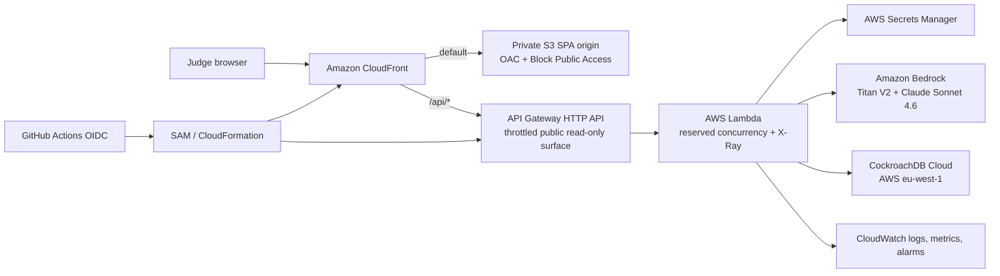

# Archon Memory — exceptional product strategy

## Product thesis

**Archon is a distributed evidence-memory control plane for financial agents.**

It does more than retrieve similar text. It remembers evidence across sessions,
separates trustworthy facts from untrusted instructions, detects contradictions and
missing references, and makes every answer inspectable.

The public challenge demo is deliberately a fixed, synthetic company:
`Helios SA / public-demo`. It is not represented as production multi-tenant SaaS and
contains no customer data.

## Judge journey

```text
remember evidence
      ↓
semantic recall over native CockroachDB C-SPANN
      ↓
grounded financial answer with exact memory citations
      ↓
self-audit: conflicts, absences, and recommended source of truth
      ↓
inspect provenance and infrastructure proof
```

The full product lifecycle after the public read-only challenge slice is:

```text
detect → explain → propose → human approve/reject → supersede → replay receipt
```

No model may silently overwrite financial truth. Resolution remains human-gated and
append-only.

## Portfolio patterns deliberately transferred

These are product patterns, not copied submissions. Any reused source code must be
listed explicitly in the repository's prior-work disclosure.

| Source project | Pattern adopted | How Archon makes it CockroachDB-specific |
|---|---|---|
| Qwen MemoryAgent (two builds) | idempotency, importance, feedback, supersession, hybrid retrieval | lifecycle fields and model-safe, tenant-prefixed native vector recall in one serializable database |
| Nebius Serverless | evaluation harness, prompt-injection cases, real-provider verification | CockroachDB vector recall, cross-scope leakage, stale-memory and node-loss evaluations |
| Microsoft Agents League / SupportTrace | typed evidence graph, hypotheses/counter-evidence, learning candidates | evidence-grade financial memory and controlled, human-reviewed procedural learning |
| Google Vibecoding / ledger | deterministic double-entry and reconciliation | exact SQL remains authoritative; the LLM extracts and explains but does not recalculate financial facts |
| OpenAI Build Week / Kerdon | authority checkpoint, before/after verification, immutable evidence pack | transactional memory resolution and replayable CockroachDB receipt |
| OpenAI Build Week / SceneProof | accept/correct/reject, source provenance, exception-first review | immutable supersession history and explicit canonical memory |
| OpenAI Build Week / ARKON | typed decision contract and terminal receipts | bounded agent actions and deterministic release evidence |
| Backblaze / Cinemory | content-addressed manifests, browser-visible verification, honest degraded state | CockroachDB transactional catalog; no object-store last-writer-wins index |
| Archon DataHub | temporal snapshots, contradiction and blast-radius analysis | candidate for a separate metadata-lineage submission, not a finance variant |

## P0 release contract

- Server-derived `tenant_id`; no caller-controlled tenant context.
- Fixed synthetic company on the unauthenticated public API.
- Row-Level Security as database-level defense in depth.
- `tenant_id + embed_model + status` prefix vector index.
- Active-only, model-space-safe recall; no unscoped public retrieval.
- Idempotent writes and content digests.
- Bounded audit input and explicit lifecycle status.
- Untrusted-evidence prompt boundary and post-generation grounding guard.
- Public read-only `health`, `recall`, `audit`, and `proof` endpoints.
- Private S3 + CloudFront frontend and same-origin API Gateway route.
- Database URL in Secrets Manager; never a plaintext Lambda environment variable.
- Least-privilege AWS role, throttling, reserved concurrency, logs, tracing, alarms.
- GitHub OIDC deployment with build/test/smoke evidence and no long-lived AWS key.
- Independent CockroachDB Cloud Managed MCP post-deploy schema audit.

## P1 after the public release is green

- `evidence_assets`, `memory_edges`, and immutable `resolution_decisions`.
- Valid-time and recorded-time temporal memory.
- Human-gated accept/override/defer workflow.
- Serializable supersession transaction and before/after replay.
- S3 evidence objects with SHA-256 identity and optional AWS KMS signature.
- Hybrid lexical/vector reranking and semantic contradiction classification.
- Citation precision, numeric groundedness, stale-memory leakage, prompt-injection,
  cross-scope leakage, and temporal-recall golden evaluations.

These features must deepen the memory story; additional AWS services or “agents” are
not added merely to increase the service count.

## AWS reference architecture



The application runs in `eu-west-1` beside the CockroachDB Cloud cluster. Titan Text
Embeddings V2 and the `eu.anthropic.claude-sonnet-4-6` inference profile were
live-verified in that region. RDS Proxy is intentionally absent: it supports RDS and
Aurora, not CockroachDB. The Lambda runtime reuses a bounded PostgreSQL connection pool
outside the handler.

For a paid production CockroachDB Advanced deployment, AWS PrivateLink is the preferred
private network path. The challenge's Basic cluster uses TLS over its public endpoint.

## Why CockroachDB, not DynamoDB or Cosmos DB

| Requirement | CockroachDB | DynamoDB | Cosmos DB |
|---|---|---|---|
| Primary model | distributed relational SQL, PostgreSQL wire | AWS key-value/document | Azure globally distributed NoSQL/multi-model |
| Multi-record truth | serializable ACID transactions, joins, constraints | transactions are bounded and key-oriented | transactional behavior is partition-oriented; broader distributed transactions have additional constraints |
| Vector memory | native vector type/index beside relational truth | typically DynamoDB → OpenSearch zero-ETL for vector search | native vector indexing, including DiskANN options |
| Best fit | evidence, provenance, approvals, ledger state and vector memory committed together | simple access patterns, enormous event/key scale, deep AWS-native integration | Azure-native globally distributed document/vector applications |
| Portability | cloud-neutral SQL application surface | AWS-native | Azure-native |

CockroachDB is the right substrate here because one transaction can keep the vector
memory, relational source of truth, provenance, lifecycle, and review receipt consistent.
That is the core product claim—not that CockroachDB universally replaces the other two.

The Qwen “Memory” project is a different layer. It is an **application-level memory
system** built over PostgreSQL/pgvector; CockroachDB is a **database substrate**. Qwen
currently has richer lifecycle functionality, while Archon's CockroachDB implementation
adds distributed SQL consistency, native C-SPANN, replication, node-loss survival, and
co-location of vector and financial truth. The target is to combine both strengths.

## Alternative submission decision

Do not start a second entry until the primary public release and evidence suite are
green.

| Candidate | Score | Decision |
|---|---:|---|
| Temporal Lineage Guardian (DataHub + AWS Glue) | 8.6/10 | best second entry; materially different metadata-governance memory |
| Cinemory Story Memory | 8.1/10 | visually distinct, lowest overlap risk; more new implementation |
| SupportTrace Persistent Incident Memory | 8.0/10 | strong memory fit; requires a clean new CockroachDB/AWS implementation |
| Kerdon finance memory | 6.8/10 | fold its patterns into Archon; too much domain overlap |
| Payroll Truth | reject | predates the challenge window and overlaps the primary |

The safest second submission is **Temporal Lineage Guardian**: persistent temporal
metadata snapshots, lineage edges, schema/owner changes, contradictions, blast radius,
and steward resolution, with AWS Glue/Data Catalog/CloudTrail as the source. It needs a
separate repo, branding, schema, demo, and prior-work disclosure.

## Delivery order

1. Close code, security, data-boundary, evaluation, infrastructure, and public-hosting
   gaps.
2. Capture repeatable deployment and live-provider receipts.
3. Freeze the demo journey and English submission copy.
4. Record the sub-three-minute video.
5. Publish any optional post and submit Devpost last.

